<!--Hi there. I'm Barney Dellar. I'm a Software Team Lead at Canon Medical in Edinburgh. I'm going to talk to you today about deliberate practice, improving your skills using katas, tooling, testing, and continuous learning. All of the code in this talk is in C++, but hopefully it is all understandable to you if you don't know the language.-->


# A Deep Dive into the Gilded Rose
### Barney Dellar
### Canon Medical
#### @branaby

---
<!--A couple of years ago I had the great pleasure of bringing Amitai Schleier in to my work for a week. Amitai's a technical Agile coach, and it was great to have him on my team for a few days. One thing he really pushed was the idea of a Learning Hour. Every day, do some deliberate practice. Practicing your skills is very common in lots of fields. People go out jogging, or do yoga, Musicians regularly practice sample pieces or scales. Martial artists perform set pieces called katas. But for some reason, it's not so common in software.-->


---
<!--In Japanese, the word "kata" is used to describe a martial-arts practice that is regular, repetitive, and choreographed. And in software, we love to borrow words from Japanese. So exercises for practicing the art of writing software are also know as katas. Although because software is complex and changing, our practices tend to be less regular and less repetitive. There is a good collection of katas on-line if you want to look for them.-->


---

<!--So on my team, we started doing regular katas. We did these using mob programming, which is a practice we use a lot in general. In these learning sessions, we practiced Test Driven Development, we tried various katas, and we had a go at learning other languages such as Haskell. And we didn't just do this because it's fun. Although learning together IS fun! We did it to become better at what we do. To make our every-day work a bit easier, to go that bit faster...-->


---
<!--And I'm going to talk to you now about one kata in particular that we spent a lot of time on. Some katas can be done in half an hour or less. But we spent weeks on one in particular, and we learnt some interesting things along the way. I'm going to share some of that with you now. I'm going to talk about the kata in general, how we got to grips with it using Approval Testing and code coverage tools, how we refactored, how we added new unit tests, how we made them expressive, and finally a look at Mocks and Stubs.-->

* Approval Testing
* Code Coverage
* Refactoring
* Test Driven Development
* Expressive unit tests
* Mocks and Stubs

---

<!--OK, I'm going to back up a bit first. I went to Clare Macrae's excellent talk last year at CppOnSea, on quickly testing legacy code. She talked about the Approval Test library, which she helped port to C++. And I thought it would be great to try and practice with this library. I work on a lot of legacy code, so I'm always keen to try out new tools and practices that can help me. So I looked for a kata that we could try as way of exploring the Approval Test library. But as we explored this kata, we ended up going much further than just using Approval Testing. And that's what I'm going to talk to you about today.-->

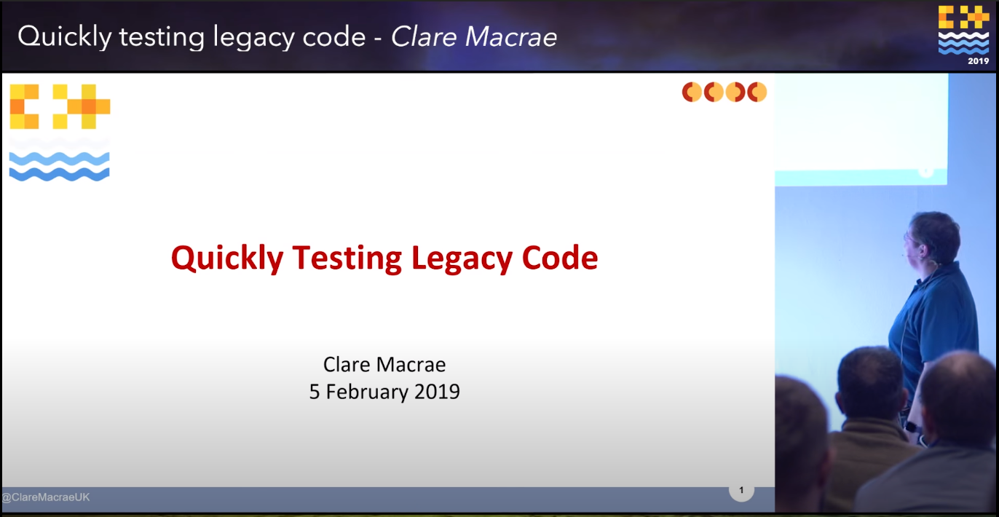

---

<!--Right. This kata, that we spent so long on, is called the Gilded Rose. Most katas start from nothing. You have an empty project, and you have to implement some tricky function or other. These can be great for practicing specific skills. But they're not representative of how we normally work.
The Gilded Rose is different. This kata is designed to mimic a real legacy codebase. You're given a readme, some code, including one class that you can modify, and some unit tests.
The kata was originally created by Terry Hughes in C#. And since then, Emily Bache has gone on to translate it into more than 40 languages.-->


---
<!--This is a list of all of the languages available from Emily's GitHub. There's quite a few of them!-->
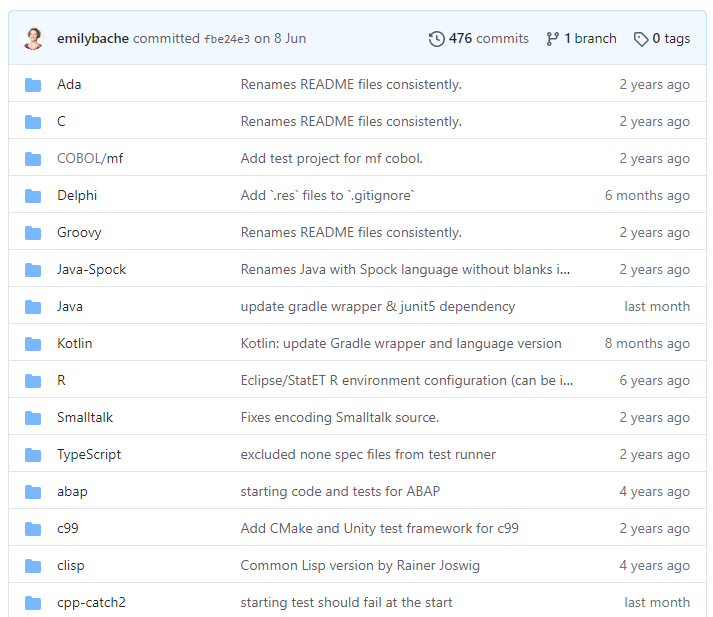

---
<!--And a few more...-->
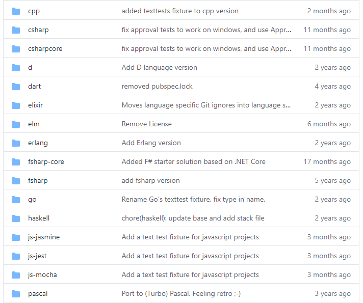

---
<!--And a few more.... Everything from perl to haskell to xslt to C++!-->
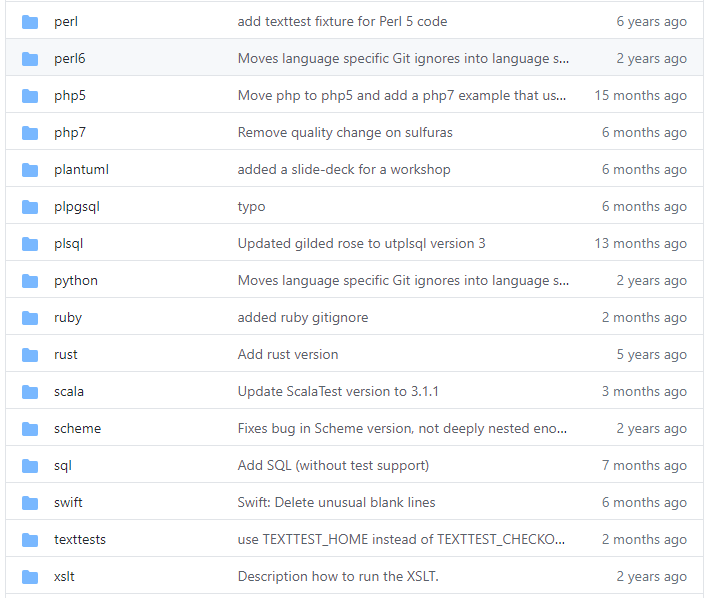

---
<!--The code for the function that you modify is only a few tens of lines long, but it's been deliberately design to be convoluted, entangled, confusing and unhelpful. There are documentation and tests, but, just as in real codebases, these can't be trusted. The only thing you're told is that the code is currently being used in a live system, so at least you know that it works, and that whatever its doing right now, you want it to keep doing that. And your job is to add some new functionality. So you want to get some tests to help you make sure that you don't break anything. And this is the function... <pause> -->
```cpp
void GildedRose::updateQuality() {
    for (int i = 0; i < items.size(); i++) {
        if (items[i].name != "Aged Brie" &&
            items[i].name != "Backstage passes to a TAFKAL80ETC concert") {
            if (items[i].quality > 0) {
                if (items[i].name != "Sulfuras, Hand of Ragnaros") {
                    items[i].quality = items[i].quality - 1;
                }
            }
        } else {
            if (items[i].quality < 50) {
                items[i].quality = items[i].quality + 1;
                if (items[i].name == "Backstage passes to a TAFKAL80ETC concert") {
                    if (items[i].sellIn < 11) {
                        if (items[i].quality < 50) {
                            items[i].quality = items[i].quality + 1;
                        }
                    }
                    if (items[i].sellIn < 6) {
                        if (items[i].quality < 50) {
                            items[i].quality = items[i].quality + 1;
                        }
                    }
                }
            }
        }
        if (items[i].name != "Sulfuras, Hand of Ragnaros") {
            items[i].sellIn = items[i].sellIn - 1;
        } 
        if (items[i].sellIn < 0) {
            if (items[i].name != "Aged Brie") {
                if (items[i].name != "Backstage passes to a TAFKAL80ETC concert") {
                    if (items[i].quality > 0) {
                        if (items[i].name != "Sulfuras, Hand of Ragnaros") {
                            items[i].quality = items[i].quality - 1;
                        }
                    }
                } else {
                    items[i].quality = items[i].quality - items[i].quality;
                }
            } else {
                if (items[i].quality < 50) {
                    items[i].quality = items[i].quality + 1;
                }
            }
        }
    }
}
```
---
<!--Even just looking at the indentation in this function, we can tell that this is a mess. <pause> It's just full of branching based on conditionals... <pause> I'll zoom in a bit so we can see it in more detail.-->
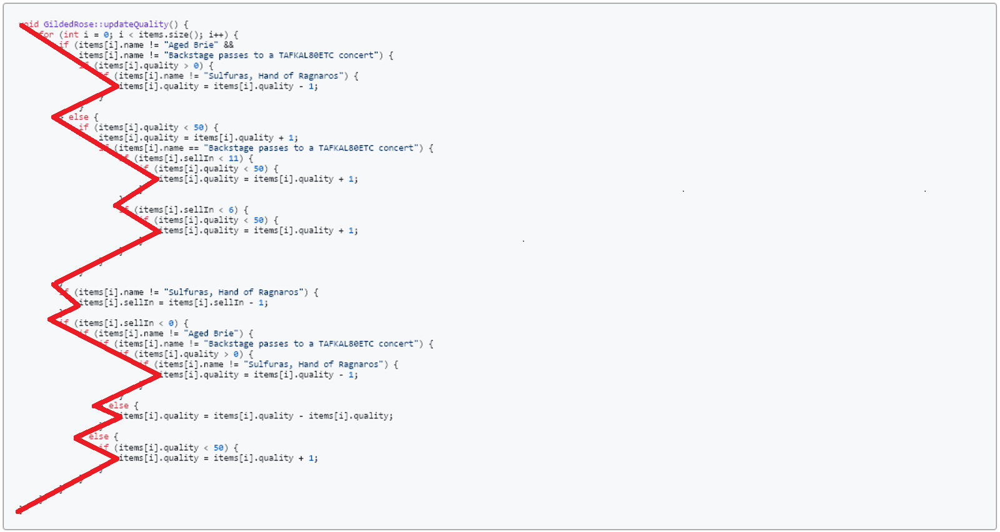

---
<!--We have a method on the GildedRose class called updateQuality. It loops through the items. For each item, if it's not aged brie *and* it's not a backstage pass, then, if the quality is above zero, and the item isn't sulfuras hand of ragnaros, we reduce the quality by one. Phew. That's the end of that if clause.-->
```cpp 
void GildedRose::updateQuality() {
    for (int i = 0; i < items.size(); i++) {
        if (items[i].name != "Aged Brie" &&
            items[i].name != "Backstage passes to a TAFKAL80ETC concert") {
            if (items[i].quality > 0) {
                if (items[i].name != "Sulfuras, Hand of Ragnaros") {
                    items[i].quality = items[i].quality - 1;
                }
            }
        }
 
```
---
<!--Else... So that means it IS aged brie or a backstage pass, if the quality is less than 50, we increase the quality by one. If it's a backstage pass, and the sell-in is less than 11, and the quality is still less than 50, we increase the quality by another one... If the sell-in is less than 6, and the quality is still less than 50, we increase the quality by another one...-->
```cpp 
        } else {
            if (items[i].quality < 50) {
                items[i].quality = items[i].quality + 1;
            
                if (
                items[i].name == "Backstage passes to a TAFKAL80ETC concert"
                ) {
                    if (items[i].sellIn < 11) {
                        if (items[i].quality < 50) {
                            items[i].quality = items[i].quality + 1;
                        }
                    }
                    if (items[i].sellIn < 6) {
                        if (items[i].quality < 50) {
                            items[i].quality = items[i].quality + 1;
                        }
                    }
                }
            }
        }
 
```
---
<!--OK, a top-level if. If the item isn't the Sulfuras hand of ragnaros, we decrease the sell-in by 1.-->
```cpp
        if (items[i].name != "Sulfuras, Hand of Ragnaros") {
            items[i].sellIn = items[i].sellIn - 1;
        }                    
```
---
<!--If the sell-in is less than 0, and if it's not aged brie, and it's not a backstage pass, and the quality is > 0, and the item is not the Sulfuras Hand Of Ragnaros, we decrease the quality by 1. Else... So, if the item IS a backstage pass, we make the quality equal to the quality minus itself.
Else, so if the item IS aged brie, and if the quality is less than 50, then we increase the quality by one.-->
```cpp 
        if (items[i].sellIn < 0) {
            if (items[i].name != "Aged Brie") {
                if (items[i].name != "Backstage passes to a 
                    TAFKAL80ETC concert") {
                    if (items[i].quality > 0) {
                        if (
                        items[i].name != "Sulfuras, Hand of Ragnaros"
                        ) {
                            items[i].quality = items[i].quality - 1;
                        }
                    }
                } else {
                    items[i].quality = 
                    items[i].quality - items[i].quality;
                }
            } else {
                if (items[i].quality < 50) {
                    items[i].quality = items[i].quality + 1;
                }
            }
        }
    }
}
                    
```
---
<!--
Now, I don't know about you, but I got lost almost immediately. Quality and Sell-in were being modified, but I'm not really sure how. Let's try the readme instead.-->
```cpp
void GildedRose::updateQuality() {
    for (int i = 0; i < items.size(); i++) {
        if (items[i].name != "Aged Brie" &&
            items[i].name != "Backstage passes to a TAFKAL80ETC concert") {
            if (items[i].quality > 0) {
                if (items[i].name != "Sulfuras, Hand of Ragnaros") {
                    items[i].quality = items[i].quality - 1;
                }
            }
        } else {
            if (items[i].quality < 50) {
                items[i].quality = items[i].quality + 1;
                if (items[i].name == "Backstage passes to a TAFKAL80ETC concert") {
                    if (items[i].sellIn < 11) {
                        if (items[i].quality < 50) {
                            items[i].quality = items[i].quality + 1;
                        }
                    }
                    if (items[i].sellIn < 6) {
                        if (items[i].quality < 50) {
                            items[i].quality = items[i].quality + 1;
                        }
                    }
                }
            }
        }
        if (items[i].name != "Sulfuras, Hand of Ragnaros") {
            items[i].sellIn = items[i].sellIn - 1;
        } 
        if (items[i].sellIn < 0) {
            if (items[i].name != "Aged Brie") {
                if (items[i].name != "Backstage passes to a TAFKAL80ETC concert") {
                    if (items[i].quality > 0) {
                        if (items[i].name != "Sulfuras, Hand of Ragnaros") {
                            items[i].quality = items[i].quality - 1;
                        }
                    }
                } else {
                    items[i].quality = items[i].quality - items[i].quality;
                }
            } else {
                if (items[i].quality < 50) {
                    items[i].quality = items[i].quality + 1;
                }
            }
        }
    }
}
```
---
```text
======================================
Gilded Rose Requirements Specification
======================================

Hi and welcome to team Gilded Rose.As you know, we are a small inn with a prime
location in a prominent city by a friendly innkeeper named Allison.We also buy
and sell only the finest goods. Unfortunately, our goods are constantly 
degrading in quality as they approach sell by date. We have a system in place that
updates our inventory for us. It was developed by a no-nonsense type name Leeroy,
who has moved on to new adventures.Your task is to add the new feature to our 
system so that we can begin selling a new category of items. First an 
introduction to our system:

- All items have a SellIn value which denotes the number of days we have to sell
  the item
- All items have a Quality value which denotes how valuable the item is
- At the end of each day our system lowers both values for every item
```
---

```text
Pretty simple, right ? Well this is where it gets interesting :

- Once the sell by date has passed, Quality degrades twice as fast
- The Quality of an item is never negative
- "Aged Brie" actually increases in Quality the older it gets
- The Quality of an item is never more than 50
- "Sulfuras", being a legendary item, never has to be sold or decreases in Quality
- "Backstage passes", like aged brie, increases in Quality as its SellIn value approaches;

Quality increases by 2 when there are 10 days or less and by 3 when there are 5 days or
less but Quality drops to 0 after the concert

We have recently signed a supplier of conjured items.This requires an update to our
system:

-"Conjured" items degrade in Quality twice as fast as normal items

Feel free to make any changes to the UpdateQuality method and add any new code as long as
everything still works correctly.However, do not alter the Item class or Items property as
those belong to the goblin in the corner who will insta - rage and one - shot you as he
doesn't believe in shared code ownership (you can make the UpdateQuality method and Items
property static if you like, we'll cover for you).

Just for clarification, an item can never have its Quality increase above 50, however
"Sulfuras" is a legendary item and as such its Quality is 80 and it never alters.
```
---
<!--Right, we have a running, live system, and our job is to update it to support conjured items. And conjured items lose quality twice as fast as normal ones. But we need to do this without changing the existing behaviour. And we don't understand the existing behaviour. I don't know about you, but I don't feel confident that I could modify the updateQuality method to support the new behaviour just now. Maybe there are tests in place that will help us.
Yes, there are two unit test files:-->
```text
Pretty simple, right ? Well this is where it gets interesting :

- Once the sell by date has passed, Quality degrades twice as fast
- The Quality of an item is never negative
- "Aged Brie" actually increases in Quality the older it gets
- The Quality of an item is never more than 50
- "Sulfuras", being a legendary item, never has to be sold or decreases in Quality
- "Backstage passes", like aged brie, increases in Quality as its SellIn value approaches;

Quality increases by 2 when there are 10 days or less and by 3 when there are 5 days or
less but Quality drops to 0 after the concert

We have recently signed a supplier of conjured items.This requires an update to our
system:

-"Conjured" items degrade in Quality twice as fast as normal items

Feel free to make any changes to the UpdateQuality method and add any new code as long as
everything still works correctly.However, do not alter the Item class or Items property as
those belong to the goblin in the corner who will insta - rage and one - shot you as he
doesn't believe in shared code ownership (you can make the UpdateQuality method and Items
property static if you like, we'll cover for you).

Just for clarification, an item can never have its Quality increase above 50, however
"Sulfuras" is a legendary item and as such its Quality is 80 and it never alters.
```
---
<!--OK... This is the first test file. It just has a main function that prints out the result of running updateQuality on some inputs 30 times. It doesn't actually test anything or assert anything. However, we can run this, and it does indeed print some values out to the console.-->
```cpp
using namespace std;
int main() {
    vector<Item> items;
    items.push_back(Item("+5 Dexterity Vest", 10, 20));
    items.push_back(Item("Aged Brie", 2, 0));
    items.push_back(Item("Elixir of the Mongoose", 5, 7));
    items.push_back(Item("Sulfuras, Hand of Ragnaros", 0, 80));
    items.push_back(Item("Sulfuras, Hand of Ragnaros", -1, 80));
    items.push_back(Item("Backstage passes to a TAFKAL80ETC concert", 15, 20));
    items.push_back(Item("Backstage passes to a TAFKAL80ETC concert", 10, 49));
    items.push_back(Item("Backstage passes to a TAFKAL80ETC concert", 5, 49));
    // this Conjured item doesn't yet work properly
    items.push_back(Item("Conjured Mana Cake", 3, 6));
    GildedRose app(items);
 
    cout << "OMGHAI!" << endl;

    for (int day = 0; day <= 30; day++) {
        cout << "-------- day " << day << " --------" << endl;
        cout << "name, sellIn, quality" << endl;
        for (vector<Item>::iterator i = items.begin(); i != items.end(); i++) {
            cout << *i << endl;
        }
        cout << endl;
        app.updateQuality();
    }
}
```
---
<!--This is the second test file. It does indeed have a test that runs. It makes sure that when an item called Foo is updated, it ends up with the name "fixme". This test fails. 
There's also a function called "example" which is never called.
So clearly this code is NOT under test! This is a problem, because we need to modify the code, without changing the existing behaviour. But there are no tests to verify the existing behaviour.
This is where Approval Testing can help! PAUSE-->
```cpp
TEST(GildedRoseTest, Foo) {
    vector<Item> items;
    items.push_back(Item("Foo", 0, 0));
    GildedRose app(items);
    app.updateQuality();
    EXPECT_EQ("fixme", app.items[0].name);
}
 
void example() {
    vector<Item> items;
    items.push_back(Item("+5 Dexterity Vest", 10, 20));
    items.push_back(Item("Aged Brie", 2, 0));
    items.push_back(Item("Elixir of the Mongoose", 5, 7));
    items.push_back(Item("Sulfuras, Hand of Ragnaros", 0, 80));
    items.push_back(Item("Conjured Mana Cake", 3, 6));
    GildedRose app(items);
    app.updateQuality();
}
```
---
<!--Approval Testing is designed to help when you have a system that repeatedly gives consistent output given consistent inputs. They are a way of performing "Golden Master" testing. You create an "ideal" state, commit it, and then verify that subsequent runs of the test produce the same result.
The Golden Master can be an image, a log file, a stream of text, anything. As long as you can compare two versions of the object and store it in version control.-->
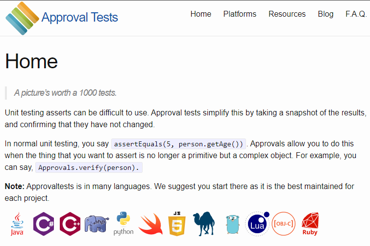

---

<!--If we're going to use Approval Testing, we need some consistent inputs that produce some consistent outputs. In our case, we do have a main function that prints out the result for a collection of inputs by updating them every day for 30 days. If we run this function a few times we can see that the results are the same every time. We could store this output in a file, and then every time we make changes to the code, we could check the output against the one in the file to make sure that it hasn't changed. And Approval Testing does almost all of this for us!-->
```cpp
using namespace std;
int main() {
    vector<Item> items;
    items.push_back(Item("+5 Dexterity Vest", 10, 20));
    items.push_back(Item("Aged Brie", 2, 0));
    items.push_back(Item("Elixir of the Mongoose", 5, 7));
    items.push_back(Item("Sulfuras, Hand of Ragnaros", 0, 80));
    items.push_back(Item("Sulfuras, Hand of Ragnaros", -1, 80));
    items.push_back(Item("Backstage passes to a TAFKAL80ETC concert", 15, 20));
    items.push_back(Item("Backstage passes to a TAFKAL80ETC concert", 10, 49));
    items.push_back(Item("Backstage passes to a TAFKAL80ETC concert", 5, 49));
    // this Conjured item doesn't yet work properly
    items.push_back(Item("Conjured Mana Cake", 3, 6));
    GildedRose app(items);
 
    cout << "OMGHAI!" << endl;

    for (int day = 0; day <= 30; day++) {
        cout << "-------- day " << day << " --------" << endl;
        cout << "name, sellIn, quality" << endl;
        for (vector<Item>::iterator i = items.begin(); i != items.end(); i++) {
            cout << *i << endl;
        }
        cout << endl;
        app.updateQuality();
    }
}
```
---
<!--We can turn this function into an Approval Test fairly simply, once we have the test framework in place.
First, we extract a helper to create the items. This is the same code we saw before. Each item gets added to a vector, and then the whole vector is returned.-->
```cpp
std::vector<Item> Items() {
    return std::vector<Item>{
        {"+5 Dexterity Vest", 10, 20},
        {"Aged Brie", 2, 0},
        {"Elixir of the Mongoose", 5, 7},
        {"Sulfuras, Hand of Ragnaros", 0, 80},
        {"Sulfuras, Hand of Ragnaros", -1, 80},
        {"Backstage passes to a TAFKAL80ETC concert", 15, 20},
        {"Backstage passes to a TAFKAL80ETC concert", 10, 49},
        {"Backstage passes to a TAFKAL80ETC concert", 5, 49},
        {"Conjured Mana Cake", 3, 6}
    };
}
```
---
<!--And then, instead of writing the output to cout, we use a stringstream. We then ask Approval Tests to verify the string for us. And we're done. It's as simple as that. We have a test in place.-->
```cpp
TEST_CASE("ApprovingText") { 
    const auto items = Items();
    GildedRose app(items);
 
    std::stringstream out_stream;
    for (int day = 0; day <= 30; day++) {
        out_stream << "----- day " << day << " -----" << ' ';
        out_stream << "name, sellIn, quality" << ' ';
        for (const auto item : items) {
            out_stream << item << ' ';
        }
        out_stream << ' ';
        app.updateQuality();
    }
 
    Approvals::verify(out_stream.str());
}
```
---
<!--So what happens when we run the test? The test framework runs the "ApprovingText" test case, generates a string, and then it hits the "Approvals::verify" step. At this point, it tries to compare the result with... something. But there's nothing to compare it to.-->
```cpp
TEST_CASE("ApprovingText") { 
    const auto items = Items();
    GildedRose app(items);
 
    std::stringstream out_stream;
    for (int day = 0; day <= 30; day++) {
        out_stream << "----- day " << day << " -----" << ' ';
        out_stream << "name, sellIn, quality" << ' ';
        for (const auto item : items) {
            out_stream << item << ' ';
        }
        out_stream << ' ';
        app.updateQuality();
    }
 
    Approvals::verify(out_stream.str());
}
```
---
<!--Luckily, the framework expects this, and it pops up a diff tool for us. In my case, it just magically finds winmerge. On the left is the new output, and on the right is nothing. All that I need to do is copy over the output to the right, save, and exit. The test run then finishes, and the "golden master" output is stored in a text file. This first test run actually fails, but if we run it again it passes silently. -->


---
<!--The framework even chooses a nice name for the file for us!-->
The output is saved to:

```text
GildedRoseTextTests.ApprovingText.approved.txt
```
---
<!--The output is something like this, going on for the 30 days. And if I run the tests again, they pass, with no prompt from Winmerge, because the output is identical. But if I change the behaviour, and re-run the tests, the system detects the difference, and prompts me to look at the change in winmerge again.
All that remains to be done is to commit the new approved output, so that it lives alongside the code.-->
```text
-------- day 0 --------
name, sellIn, quality
+5 Dexterity Vest, 10, 20
Aged Brie, 2, 0
Elixir of the Mongoose, 5, 7
Sulfuras, Hand of Ragnaros, 0, 80
Sulfuras, Hand of Ragnaros, -1, 80
Backstage passes to a TAFKAL80ETC concert, 15, 20
Backstage passes to a TAFKAL80ETC concert, 10, 49
Backstage passes to a TAFKAL80ETC concert, 5, 49
Conjured Mana Cake, 3, 6
 
-------- day 1 --------
name, sellIn, quality
+5 Dexterity Vest, 9, 19
Aged Brie, 1, 1
Elixir of the Mongoose, 4, 6
Sulfuras, Hand of Ragnaros, 0, 80
Sulfuras, Hand of Ragnaros, -1, 80
Backstage passes to a TAFKAL80ETC concert, 14, 21
Backstage passes to a TAFKAL80ETC concert, 9, 50
Backstage passes to a TAFKAL80ETC concert, 4, 50
Conjured Mana Cake, 2, 5
```
---
<!--So, that's great. We have some tests running, and these are now committed. But... How do we know if this test is comprehensive? The inputs are just the random strings that were in the unused test Main() function. We can tell that *some* code is being invoked, because the values in the output change day to day. But are the tests covering all of the production code? We need a code coverage tool!-->
```text
-------- day 0 --------
name, sellIn, quality
+5 Dexterity Vest, 10, 20
Aged Brie, 2, 0
Elixir of the Mongoose, 5, 7
Sulfuras, Hand of Ragnaros, 0, 80
Sulfuras, Hand of Ragnaros, -1, 80
Backstage passes to a TAFKAL80ETC concert, 15, 20
Backstage passes to a TAFKAL80ETC concert, 10, 49
Backstage passes to a TAFKAL80ETC concert, 5, 49
Conjured Mana Cake, 3, 6
 
-------- day 1 --------
name, sellIn, quality
+5 Dexterity Vest, 9, 19
Aged Brie, 1, 1
Elixir of the Mongoose, 4, 6
Sulfuras, Hand of Ragnaros, 0, 80
Sulfuras, Hand of Ragnaros, -1, 80
Backstage passes to a TAFKAL80ETC concert, 14, 21
Backstage passes to a TAFKAL80ETC concert, 9, 50
Backstage passes to a TAFKAL80ETC concert, 4, 50
Conjured Mana Cake, 2, 5
```
---
<!--On my team, we normally use Bullseye to check our code coverage, with integration into Visual Studio. So, we can turn on Bullseye, rebuild, run the tests, and then have a look at the output. 
We can see that every part of the UpdateQuality() function has been called. That's good, because the test is just one that we found lying around, with a bunch of random inputs.
-->
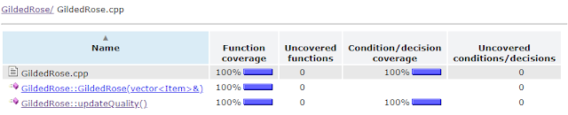

---
<!--I always like to double check that my results are good. Imagine if we didn't have the Aged Brie in the list of items. It's commented out here:-->
```cpp
std::vector<Item> Items() {}
    std::vector<Item> items;
    items.push_back(Item("+5 Dexterity Vest", 10, 20));
    //items.push_back(Item("Aged Brie", 2, 0));
    items.push_back(Item("Elixir of the Mongoose", 5, 7));
    items.push_back(Item("Sulfuras, Hand of Ragnaros", 0, 80));
    items.push_back(Item("Sulfuras, Hand of Ragnaros", -1, 80));
    items.push_back(Item("Backstage passes to a TAFKAL80ETC concert", 15, 20));
    items.push_back(Item("Backstage passes to a TAFKAL80ETC concert", 10, 49));
    items.push_back(Item("Backstage passes to a TAFKAL80ETC concert", 5, 49));
    // this Conjured item doesn't yet work properly
    items.push_back(Item("Conjured Mana Cake", 3, 6));
    return items;
}
```
---
<!--If we run the tests now, we can clearly see that we no longer have full coverage. So, this tells us that our Approval Tests are giving us 100% coverage, and we haven't had to investigate any production code or behaviour at all yet. Nice :-) 
Now, full code coverage doesn't tell you that tell your tests are good. It just tells you that they *might* be good. A test that invokes every line and then just asserts true has no value. -->
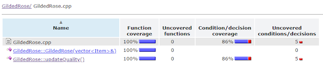

---
<!--In our case, we can see that the full state of each Item is being printed out, and that they're changing as we call UpdateQuality. 
And we also know that this output is being checked to make sure it doesn't change. So we can be pretty confident that we have a good test harness in place.-->
```text
-------- day 0 --------
name, sellIn, quality
+5 Dexterity Vest, 10, 20
Aged Brie, 2, 0
Elixir of the Mongoose, 5, 7
Sulfuras, Hand of Ragnaros, 0, 80
Sulfuras, Hand of Ragnaros, -1, 80
Backstage passes to a TAFKAL80ETC concert, 15, 20
Backstage passes to a TAFKAL80ETC concert, 10, 49
Backstage passes to a TAFKAL80ETC concert, 5, 49
Conjured Mana Cake, 3, 6
 
-------- day 1 --------
name, sellIn, quality
+5 Dexterity Vest, 9, 19
Aged Brie, 1, 1
Elixir of the Mongoose, 4, 6
Sulfuras, Hand of Ragnaros, 0, 80
Sulfuras, Hand of Ragnaros, -1, 80
Backstage passes to a TAFKAL80ETC concert, 14, 21
Backstage passes to a TAFKAL80ETC concert, 9, 50
Backstage passes to a TAFKAL80ETC concert, 4, 50
Conjured Mana Cake, 2, 5
```
---
<!--So, we have a test harness, but the code is still a mess. And we need to add new functionality. So first, we're going to tidy up the existing code. If we change the behaviour, our tests should tell us.
Refactoring is also a great way of learning about a piece of code.-->
# <center>Refactoring</center>

```text
For each desired change, 
make the change easy 
(warning: this may be hard),
then make the easy change.
```
~ Kent Beck

---
<!--The goal of refactoring is to change the structure of the code, without changing the behaviour. 
With refactoring, it's really important to take small steps. We do this by making small changes, running the tests, and then committing. Changes that make the tests fail can just be reverted.-->
# <center>Refactoring</center>
<center>Changing the structure of the code

without changing the behaviour</center>

---
<!--The first step we can take is to remove one of the two test files. We have made one work for our Approval Tests, and the other just declares a broken test, and an unused function. So it can go. 

Once we've done that, we can look at our UpdateQuality method. Most of the changes we make are going to be either Extract Variable, or Extract Method. These are standard refactorings, where you pull a complex expression out and give it a name, or pull a complex piece of logic out and give it a name.-->
# <center>Refactoring</center>
<center>Extract Variable

Extract Method</center>

---
<!--OK, on to the refactoring. As an example of Extracting a variable, we have a few places that check if the the item name is not "Sulfuras, Hand of Ragnaros". 
-->

```cpp
if (items[i].name != "Sulfuras, Hand of Ragnaros")
```

---
<!--We can easily introduce a variable and use that every time. Note that this also makes the if statement easier to read, and easier to understand. We've raised the level of abstraction away from comparing the name of the ith item against another string, to looking at what kind of item this is. We've given a good name to what was just an anonymous expression.
We can then run the tests and make sure that they still pass. This kind of refactoring is a really easy way to start exploring complex legacy code. Each change makes the code a little bit easier to understand. But it also gives us a way of walking through the code, to help us build up a mental model of it. And as we build up that mental model, more and more complex changes become more and more obvious.-->

```cpp
if (items[i].name != "Sulfuras, Hand of Ragnaros")
```

replace with 

```cpp
const bool not_sulfuras = 
    items[i].name != "Sulfuras, Hand of Ragnaros";
```
```cpp
if (not_sulfuras)
```
---
<!--As an example of Extract Method, this code pops up a few times in the updateQuality method-->

```cpp
if (items[i].quality < 50) {
    items[i].quality = items[i].quality + 1;
}
```

---
<!--We can move that code into a helper function, tidy it a bit, and call it instead. And again, we have given a name - hopefully a good name - to what was just a block of code.-->

```cpp
    if (items[i].quality < 50) {
        items[i].quality = items[i].quality + 1;
    }
```

replace with 

```cpp
void IncrementQuality(Item& item) {
    if (items[i].quality < 50) {
        items[i].quality++;
    } 
}
```
```cpp
    IncrementQuality(item);
```
---
<!--And, after a few iterations of this, we can get to something like this. We've extracted out some useful helper functions, each of which is small enough to understand.-->
```cpp
void IncrementQuality(Item& item) {
    if (item.quality < 50) {
        item.quality++;
    }
}
 
void DecrementQuality(Item& item) {
    const auto quality_above_0 = item.quality > 0;
    if (quality_above_0) {
        item.quality--;
    }
}

void IncreaseBackstagePassValue(Item& item) {
    if (item.sellIn < 11) {
        IncrementQuality(item);
        if (item.sellIn < 6) {
            IncrementQuality(item);
        }
    }
}
```

---
<!--Some of the helpers are bit more complex, like this one. But it's still possible to reason about them-->
```cpp
void UpdateQualityOfExpired(Item& item) {
    if (!IsExpired(item)) {
        return;
    }

    const auto brie = item.name == "Aged Brie";
    const auto backstage_pass = 
        item.name == "Backstage passes to a TAFKAL80ETC concert";

    if (brie) {
        IncrementQuality(item);
    } else if (backstage_pass) {
        item.quality = 0;
    } else {
        DecrementQuality(item);
    } 
}
```
---
<!--But the end result is that our actual updateQuality method is easy to understand. We iterate over all items. We skip Sulfuras. We then update the quality and decrement the sell-in. And then we update the quality for expired items. Done. It turns out that that was what the original 50 line function was doing. -->
```cpp
void GildedRose::updateQuality() {
    for (auto& item : m_items) {
        if (IsSulfuras(item)) {
            continue;
        }
 
        UpdateQualityOf(item);
        DecrementSellInOf(item);
        UpdateQualityOfExpired(item);
    }
}
```
---
<!--For comparison, here is the original version. And we were able to make these changes because we had the Approval Test harness in place. -->
```cpp  
void GildedRose::updateQuality() {
    for (int i = 0; i < items.size(); i++) {
        if (items[i].name != "Aged Brie" &&
            items[i].name != "Backstage passes to a TAFKAL80ETC concert") {
            if (items[i].quality > 0) {
                if (items[i].name != "Sulfuras, Hand of Ragnaros") {
                    items[i].quality = items[i].quality - 1;
                }
            }
        } else {
            if (items[i].quality < 50) {
                items[i].quality = items[i].quality + 1;
 
                if (items[i].name == "Backstage passes to a TAFKAL80ETC concert") {
                    if (items[i].sellIn < 11) {
                        if (items[i].quality < 50) {
                            items[i].quality = items[i].quality + 1;
                        }
                    }
                    if (items[i].sellIn < 6) {
                        if (items[i].quality < 50) {
                            items[i].quality = items[i].quality + 1;
                        }
                    }
                }
            }
        } 
        if (items[i].name != "Sulfuras, Hand of Ragnaros") {
            items[i].sellIn = items[i].sellIn - 1;
        }
        if (items[i].sellIn < 0) {
            if (items[i].name != "Aged Brie") {
                if (items[i].name != "Backstage passes to a TAFKAL80ETC concert") {
                    if (items[i].quality > 0) {
                        if (items[i].name != "Sulfuras, Hand of Ragnaros") {
                            items[i].quality = items[i].quality - 1;
                        }
                    }
                } else {
                    items[i].quality = items[i].quality - items[i].quality;
                }
            } else {
                if (items[i].quality < 50) {
                    items[i].quality = items[i].quality + 1;
                }
            }
        }
    }
}
```
---
<!--I hope that you agree that this is much more understandable. The functions are much smaller; there are no crazy nested conditionals, and the code has been modernised a bit. If you want to see a masterclass in refactoring this kata, I've included a link at the end to Sandi Metz solving it in Ruby.
But either way, our code is now understandable enough for us to try and implement the new requirement.-->
```cpp
void GildedRose::updateQuality() {
    for (auto& item : m_items) {
        if (IsSulfuras(item)) {
            continue;
        }
 
        UpdateQualityOf(item);
        DecrementSellInOf(item);
        UpdateQualityOfExpired(item);
    }
}

```
---
<!--Let's check the new requirement again. Here is the relevant section from the Readme: We can now move on to adding this feature.-->

```text
We have recently signed a supplier of conjured items. This requires
an update to our system:

 - "Conjured" items degrade in Quality twice as fast as normal items
```

---
<!--OK, we need to support "Conjured" items, whatever they are. If we look at our Approval Test, there is a hint there too: It looks like someone in the past thought that you should define a conjured item by starting the name with the word "Conjured". We can work with that.-->
```cpp
std::vector<Item> Items() {
    return std::vector<Item>{
        {"+5 Dexterity Vest", 10, 20},
        {"Aged Brie", 2, 0},
        {"Elixir of the Mongoose", 5, 7},
        {"Sulfuras, Hand of Ragnaros", 0, 80},
        {"Sulfuras, Hand of Ragnaros", -1, 80},
        {"Backstage passes to a TAFKAL80ETC concert", 15, 20},
        {"Backstage passes to a TAFKAL80ETC concert", 10, 49},
        {"Backstage passes to a TAFKAL80ETC concert", 5, 49},
        // this Conjured item doesn't yet work properly
        {"Conjured Mana Cake", 3, 6}
    };
}
```

---
<!--For the new requirements, we'll use TDD. As I mentioned before, katas such as this are a great way of practicing skills such as TDD. The idea is to add a small requirement in the form of a test, and then implement just enough code to satisfy the requirement.-->
# <center>Test Driven Development</center>
## <center>(TDD)</center>

---
<!--Each unit test should be just a few lines long. It's good practice to break these up into three blocks: Arrange Act Assert, or Given When Then. First we Arrange things. You can use the REQUIRE test here, which will halt if things haven't been set up properly. Then we Act. This should be single action. When we do this, Then we expect our assertion to pass. And ideally there should be a single assertion. We use CHECK here, which will not halt execution if it fails. This is so that if we have two CHECKS, we can see if they both fail, or just one fails if we get any failures.-->
```cpp
TEST_CASE("Unit Tests should be well structured") {
    Do some set up here;
    And maybe some more set up here;
    REQUIRE(Everything is set up);

    Do something;

    CHECK(Our Expectations are met);
}
```
---
<!--I like to use two blank lines to break up the test. If you need more blank lines, your test is probably too complex and should be broken up.
It's also good practice not to over-constrain the assertion. If you're testing that something should log, just test that it logs. Don't test the exact log message. Overly strict tests prevent you from changing code later.-->
```cpp
TEST_CASE("Unit Tests should be well structured") {
    Do some set up here;
    And maybe some more set up here;
    REQUIRE(Everything is set up);

    Do something;

    CHECK(Our Expectations are met);
}
```
---
<!--OK, our first test detects whether something is not conjured. There is no real Action here. This test fails initially, because we don't have an IsConjured() function. So we need to add that:-->
```cpp
TEST_CASE("Non-conjured items are not Conjured") {
    auto named_item = Item{"Aged Brie", 2, 0};

    CHECK(!Detail::IsConjured(named_item));
}
```
---
<!--The function just always returns false. The tests pass, so we can commit :-) -->
```cpp
TEST_CASE("Non-conjured items are not Conjured") {
    auto named_item = Item{"Aged Brie", 2, 0};

    CHECK(!Detail::IsConjured(named_item));
}
```
```cpp
bool IsConjured(Item& item) {
    return false;
}
```
---
<!--Now we can add a test to detect that something is conjured:-->
```cpp
TEST_CASE("A conjured item is Conjured") {
    auto named_item = Item{"Conjured Mana Cake", 3, 6};

    CHECK(Detail::IsConjured(named_item));
}
```
---
<!--This now forces us to do something more clever in our implementation. This is known as Triangulation in TDD. You add a test that forces some change in direction in the code. Both tests pass, so we can commit again.-->
```cpp
TEST_CASE("A conjured item is Conjured") {
    auto named_item = Item{"Conjured Mana Cake", 3, 6};
    CHECK(Detail::IsConjured(named_item));
}
```
```cpp
bool IsConjured(Item& item) {
    return item.name.substr(0,8) == "Conjured";        
}
```
---
<!--We can now move on to look at quality. We can start by testing our assumptions about the current behaviour. We expect non-conjured items that have not expired to decrease in quality by one per day.
We expect this test to pass, and it does. Great, our assumptions match reality. We can commit this new test, and then move on to the real requirement...-->
```cpp
TEST_CASE("Non-conjured items degrade in quality by 1 per day") {
    const auto initial_quality = 6;
    const auto expected_quality = initial_quality - 1;
    std::vector<Item> item_list = Mana Cake", 3, initial_quality}};
    auto gilded_rose = GildedRose(item_list);

    gilded_rose.updateQuality();

    CHECK(item_list.back().quality == expected_quality);
}
```
---
<!--In this test for conjured items, we use conjured mana cake. We want its quality to go down by two instead of one. As expected, this fails right now, so we need to make it pass. -->
```cpp
TEST_CASE("Conjured items degrade in quality twice as fast") {
    const auto initial_quality = 6;
    const auto expected_quality = initial_quality - 2;
    std::vector<Item> item_list = {{"Conjured Mana Cake", 3, initial_quality}};
    auto gilded_rose = GildedRose(item_list);

    gilded_rose.updateQuality();
    
    CHECK(item_list.back().quality == expected_quality);
}
```
---
<!--We have our existing DecrementQuality() function: -->
```cpp
void DecrementQuality(Item& item) {
    const auto quality_above_0 = item.quality > 0;
    if (quality_above_0) {
        item.quality--;
    }
}
```
---
<!--And it is not too hard to modify it to make use of our new IsConjured() function, and to decrement the quality again for conjured items. This passes our test :-)-->
```cpp
void DecrementQuality(Item& item) {
    const auto conjured = IsConjured(item);
 
    const auto quality_above_0 = item.quality > 0;
    if (quality_above_0) {
        item.quality--;
        if (conjured) {
            item.quality--;
        }
    }
}
```
---
<!--Ah, but now our unit tests pass, but our Approval Tests fail... Of course, the Conjured Mana Cake is now losing quality at twice the speed, so we get different output. -->

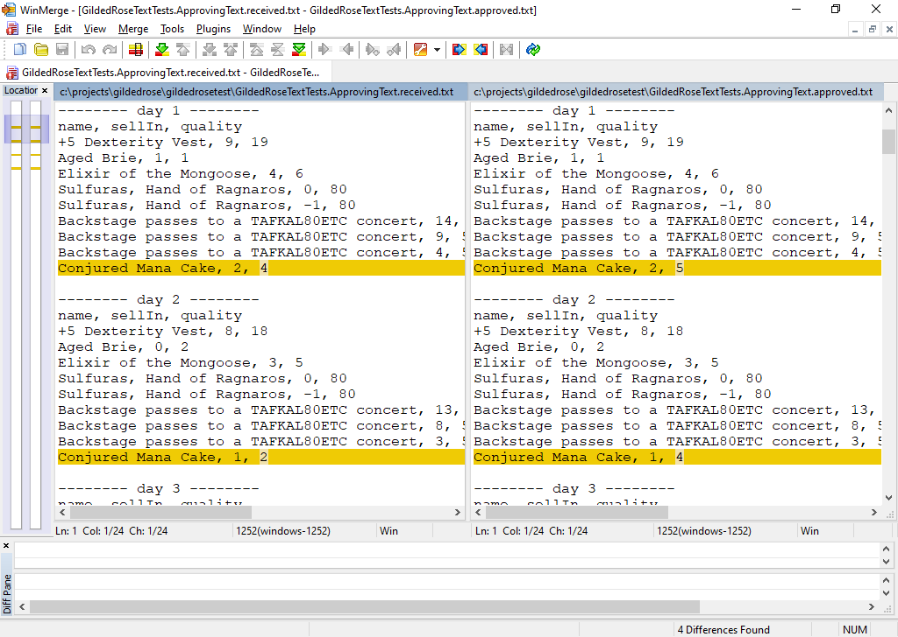

---
<!--Here's the four changes. So, we can check the new output, make sure it's fine. As we can see, the conjured mana cake is now degrading twice as fast, as expected. So we can copy the new output over to the Approved file. This can then be committed as the new Gold Standard.-->

## Old behaviour:

"Conjured Mana Cake, 3, 6"
"Conjured Mana Cake, 2, <mark>5</mark>"
"Conjured Mana Cake, 1, <mark>4</mark>"
"Conjured Mana Cake, 0, <mark>3</mark>"
"Conjured Mana Cake, -1, <mark>1</mark>"

## New Behaviour
"Conjured Mana Cake, 3, 6"
"Conjured Mana Cake, 2, <mark>4</mark>"
"Conjured Mana Cake, 1, <mark>2</mark>"
"Conjured Mana Cake, 0, <mark>0</mark>"
"Conjured Mana Cake, -1, <mark>0</mark>"

---
<!--If we look at our new DecrementQuality() function, we can see that we are decrementing the quality twice if the item is conjured. This is fine if the quality is large enough. But what if the quality of a conjured item starts at 1? We'll decrement it once, and then again because it is conjured.-->
```cpp
void DecrementQuality(Item& item) {
    const auto conjured = IsConjured(item);
 
    const auto quality_above_0 = item.quality > 0;
    if (quality_above_0) {
        item.quality--;
        if (conjured) {
            item.quality--;
        }
    }
}
```
---
 <!--We should add a test for this! This fails right now-->
```cpp
TEST_CASE("Quality of conjured items does not go below zero") {
    const auto initial_quality = 1;
    const auto expected_quality = 0;
    std::vector<Item> item_list = {{"Conjured Mana Cake", 3, initial_quality}};
    auto gilded_rose = GildedRose(item_list);

    gilded_rose.updateQuality();
    
    CHECK(item_list.back().quality == expected_quality);
}
```
---
<!--We can make this pass by checking the quality before decrementing it again. This is ugly, but at least it works, and we could start refactoring and tidying again, now that all tests pass.-->
```cpp
void DecrementQuality(Item& item) {
    const auto conjured = IsConjured(item);
 
    auto quality_above_0 = item.quality > 0;
    if (quality_above_0) {
        item.quality--;
        if (conjured) {
            auto quality_above_0 = item.quality > 0;
            if (quality_above_0) {
                item.quality--;
            }
        }
    }
}
```

---
<!--We have pretty much solved the original kata here, but it's always good to leave code in a good state for the next person to come across it. Always leave things in a cleaner state than you found them. And the main thing that's missing at the moment is comprehensive unit tests. So we should add them, and refactor as we go. And we want our unit tests to be expressive, with as few magic numbers as possible. -->
# <center>Expressive Unit Tests</center>

---
<!--Let's look at an example. We have an IncrementQuality() function, and this should never increment the quality if it's more than 50. So we have some interesting edge cases to think about. Obviously, any quality below 50 should get incremented. So 3 should go to 4, 10 should go to 11. And 49 should go to 50, but 50 should stay at the same value. And so should anything above 50. The function works on ints, so we should make sure it copes well with extreme values, like the min and max int values-->
```cpp
void IncrementQuality(Item& item) {
    if (item.quality < 50) {
        item.quality++;
    }
}
```
---
<!--In other words, we're very interested in the few values around 50, to make sure that we're not out by one, and we're slightly interested in the numerical limits, and zero's often a value that can go wrong. And we want it to work for any other value in between. So we want to write tests that reflect that interest.-->

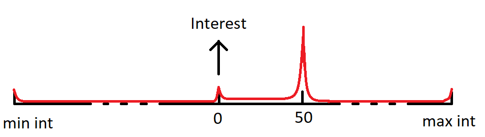

---
<!--Initially, we wrote tests for 0, for 1, for 49, for 50, for 51, and for the numerical limits. But it was very verbose. And there's loads of duplication in the tests, as you can see. So the intent behind the tests becomes lost in all the noise of repeated tests.-->
```cpp
TEST_CASE("0 increments to 1") {
    const auto initial_quality = 0;
    const auto expected_quality = 1;

    auto item = Item{"Aged Brie", 2, initial_quality};
    
    CHECK(item_list.back().quality == expected_quality);
}

TEST_CASE("49 increments to 50") {
    const auto initial_quality = 49;
    const auto expected_quality = 50;

    auto item = Item{"Aged Brie", 2, initial_quality};
    
    CHECK(item_list.back().quality == expected_quality);
}

TEST_CASE("50 doesn't increment") {
    const auto initial_quality = 50;
    const auto expected_quality = initial_quality;

    auto item = Item{"Aged Brie", 2, initial_quality};
    
    CHECK(item_list.back().quality == expected_quality);
}
```
---
<!--We also end up with horrible arbitrary hard-coded numbers. Someone reading this might think that 8 , 9 and 1012 were chosen for a good reason, but they weren't. We chose them fairly arbitrarily, but now we have made them very specific.-->
```cpp
TEST_CASE("8 increments to 9") {
    const auto initial_quality = 8;
    const auto expected_quality = 9;

    auto item = Item{"Aged Brie", 2, initial_quality};
    
    CHECK(item_list.back().quality == expected_quality);
}

TEST_CASE("1012 doesn't increment") {
    const auto initial_quality = 1012;
    const auto expected_quality = initial_quality;

    auto item = Item{"Aged Brie", 2, initial_quality};
    
    CHECK(item_list.back().quality == expected_quality);
}
```
---
<!--So we used generators.
These allow us to specify a list of values, and to run the test for *all* the values in the list. So this test now runs three times: once for int_min, once for zero, and once for 49.-->
```cpp
TEST_CASE("Quality increments when it's 49 or less") {
    auto original_quality = GENERATE(
        std::numeric_limits<int>::min(),
        0,
        49
    );
 
    auto item = Item{"Aged Brie", 2, original_quality};
    Detail::IncrementQuality(item);
 
    CHECK(item.quality == original_quality + 1);
}

```
---
<!--But you can actually go even further. You can specify a range, you can ask for random numbers from a range, you can apply filters etc-->

```cpp
// Use every number between 0 and 50
GENERATE(range(0,50));
``` 
<br>

```cpp
// Take 10 random number between 0 and 100
GENERATE(take(10, random(0, 100)));
```
<br>

```cpp
const auto IsOdd = [](auto i) {return i%2 == 1;};

// Take 5 random odd numbers between -100 and 100
GENERATE(take(5, filter(IsOdd, random(-100, 100))));
``` 
---
<!--So we ended up with this. We take the minimum numerical limit, 100 random numbers between that limit and zero, and every number between 0 and 49. To make it explicit, we also list 49 as a single value. And then we make sure that the quality is incremented.-->
```cpp
TEST_CASE("Quality increments when it's 49 or less") {
    auto original_quality = GENERATE(
        std::numeric_limits<int>::min(),
        take(100, random(std::numeric_limits<int>::min(), 0)),
        range(0,49),
        49
    );
 
    auto item = Item{"Aged Brie", 2, original_quality};
    Detail::IncrementQuality(item);
 
    CHECK(item.quality == original_quality + 1);
}

```
---
<!--In the second test, we take 50 explicitly, and then every number between 51 and 60, 100 random numbers between 61 and the max numerical limit, and the max numerical limit itself. And with that, we've really captured our requirements for the function in two very expressive tests. We don't have to arbitrarily choose random numbers and test them. And we've ended up with two tests, which is right, because in this toy example, our function splits the integers into two hlaves: above 50, and below 50. Our tests now reflect this. -->
```cpp
TEST_CASE("Quality doesn't increase when it's 50 or more") {
    auto original_quality = GENERATE(
        50,
        range(51,61),
        take(100, random(61, std::numeric_limits<int>::max())),
        std::numeric_limits<int>::max()
    );
 
    auto item = Item{"Aged Brie", 2, original_quality};
    Detail::IncrementQuality(item);
 
    CHECK(item.quality == original_quality);
}
```
---
<!--So, we added in unit tests using these really nice generators. The last thing I wanted to go through with my team was the idea of using Test Doubles. Historically, C++ has lagged behind other languages with support for these, but there have been big improvements in recent years.-->
# <center>Test Doubles</center>
<center>Mocks

Stubs
</center>

---
<!--So I gave my team a new requirement that there should be some logging if something went wrong. Say, if IncrementQuality() was called when the item already had a quality above 50. 
By itself, this is not too difficult, and it even lends itself well to Approval Testing. If we run the application, or if we call the updateQuality method from a test, then it should produce a log, and we can store that as an approved Golden Master.-->
# <center>Logging to File</center>

---
<!--First, we want to make sure that we have a logger that works. Here's a simple test that the updateQuality method produces a good log. This will allow future developers to quickly catch any unexpected changes to the log. The last line is the one that actually does the assert.-->

```cpp
TEST_CASE("The log file is as expecetd") {
    const auto log_file = "log.log";
    std::filesystem::remove(log_file);

    auto items = Items();
    GildedRose app(items);
    {
        FileLogger logger;
        for (int day = 0; day <= 30; day++) {
            app.updateQuality(logger);
        }
    }

    Approvals::verifyExistingFile(log_file);
}
```
---
<!-- We can start to make the test pass by modifying our updateQuality method. It now takes in a logger, and it logs something. The logger also gets forwarded on to other functions that might want to log.-->
```cpp
void GildedRose::updateQuality(ILogger& logger) {
    
    logger.log("Updating quality");

    for (auto& item : m_items) {
        if (IsSulfuras(item)) {
            continue;
        }
 
        UpdateQualityOf(item, logger);
        DecrementSellInOf(item);
        UpdateQualityOfExpired(item, logger);
    }
}
```
---
<!--The tests don't pass though, because we don't actually have a logger yet. So let's make one so that the test can run, and, hopefully, pass. We start by declaring an interface. It has a single pure virtual function called "log" that takes in a string to log.-->
```cpp
class ILogger
{
public:
    virtual void log(std::string str) = 0;
};
```
---
<!--And then we can define a concrete implementation: 
It's a simple wrapper round a C++ library called spdlog, and it just forwards calls on to spdlog.-->
```cpp
class FileLogger final : public ILogger
{
public:
    FileLogger() {
        m_logger = spdlog::basic_logger_mt(
            "basic_logger", 
            "log.log"
        );
    }
    ~FileLogger() {
        spdlog::drop_all();
    }
    void log(const std::string message) override {
        m_logger->info(message);
    }
private:
    std::shared_ptr<spdlog::logger> m_logger;
};
```
---
<!--Our test now compiles and runs. And the first time we run it, we get winmerge up as expected. We can copy the output over to approve this file, and commit it.-->
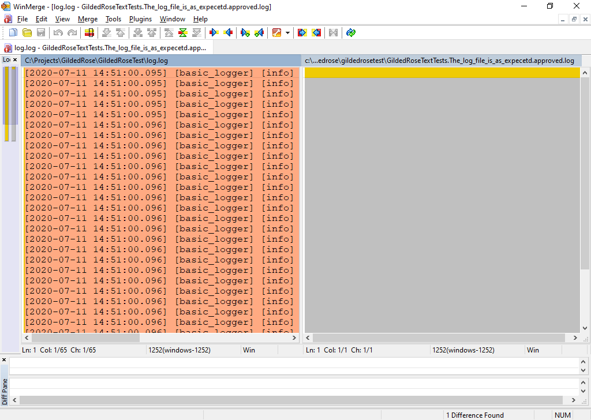

---
<!--But if we re-run it to make sure it passes again... It doesn't. It fails, because the new output doesn't match the old output. The time subtly differs for each run. And it will be different EVERY time we run the tests, because time keeps moving forwards. The output will never match a previous run. We have inconsistent output. And Approval Testing relies on having consistent output given consistent input.-->
First run:
```text
[2020-07-11 14:52:43.103] [basic_logger] [info] Updating quality
```
Second run:
```text
[2020-07-11 14:53:05.133] [basic_logger] [info] Updating quality
```
---
<!--Luckily, the Approval Test framework has thought of this! We just create an Options object which in turn has a Scrubber inside it. And the scrubber uses a regex to do the work.-->
```cpp
inline ApprovalTests::Options Munger() {
    
    const std::string dateRegex = 
        "\\[[0-9]{4}-[0-9]{2}-[0-9]{2} [0-9]{2}:[0-9]{2}:[0-9]{2}.[0-9]{3}\\]";
    
    const std::string replacementText = "[MUNGED_DATE_TIME]";
    
    const auto munger = Scrubbers::createRegexScrubber(
        dateRegex, 
        replacementText
    );
    
    return Options(munger).
        fileOptions().
        withFileExtension(".log");
}
```
---
<!--Using the new munger is easy. In our tests, we just pass a munger in to the Verify call -->
```cpp
TEST_CASE("Test log") {
    WriteLog();
    Approvals::verifyExistingFile(log_file, Munger());
}
```
<br/>

First run:
```text
[MUNGED_DATE_TIME] [basic_logger] [info] Updating quality
```
Second run:
```text
[MUNGED_DATE_TIME] [basic_logger] [info] Updating quality
```
---
<!--And having a logger is all very well, but when we run *unit* tests, we *never* want to write to file. File IO is *very* slow, and we really want our unit tests to be super fast. It's OK for Approval Tests to write to file - they have no other choice. But if we can keep them separate, we can still have very fast unit tests.

And yet, we want to be able to test that our functions are writing to the log when they should. Furthermore, we also want our other unit tests to work smoothly without having to worry about the logs, and to still run fast.

This is where mocks and stubs can help us. Let's look at stubs first. Here's Martin Fowler's definition-->
# <center>Stubs</center>

</br>

```text
"Stubs provide canned answers to calls made during the
test, usually not responding at all to anything outside
what's programmed in for the test." 
```
~ Martin Fowler

---
<!--In our case, in our unit tests, we want a logger that does nothing when it's asked to log. So if we have unit test which tests that incrementing the quality above 50 does nothing, it should not try and write to file. The only external API on our logger is the "log" method, so we can just override that one method to do nothing in our StubLogger.-->
```cpp
class ILogger
{
public:
    virtual void log(std::string str) = 0;
};
```

```cpp
class StubLogger : public ILogger {
public:
    void log(std::string str) override {}
};
```
---
<!--If we use this logger in our unit tests, whenever something asks to log, the logger will just ignore the request. That's a perfect stub. So if we have a function like IncrementQuality, which expects a logger, then we can easily use a stub in our tests, with a simple helper like TestIncrementQuality.
Now when our test runs, the code inside IncrementQuality might try and log, but it will use the stub logger, and it will do nothing. The unit test will still run quickly :-)-->
```cpp
void Detail::IncrementQuality(Item& item, ILogger& logger);
```
```cpp
void TestIncrementQuality(Item& i) {
    StubLogger stub_logger;
    Detail::IncrementQuality(i, stub_logger);
}
```
```cpp
TEST_CASE("cannot increment quality if 50 or over") {
    auto original_quality = GENERATE(
        range(50,61),
        take(100, random(61, std::numeric_limits<int>::max())),
        std::numeric_limits<int>::max()
    );
    auto item = Item{"Aged Brie", 2, original_quality};

    TestIncrementQuality(item);

    CHECK(item.quality == original_quality);
}
```
---
<!--Great, so some of our unit tests are executing code that tries to log, but the log calls never write to file. 
But what if we want to know that something *was* logged? This is where mocks come in. Again, here's Martin Fowler's definition: <read!> In other words, we can set expectations on a mock, such as "log should be called", and then we can assert that this expectation was met.
We can also set an expectation such as "log should NOT be called", and assert on this too.
To do this, we really need a mocking framework. Mocking frameworks allow us to create mocks quickly, without loads of boilerplate.-->
# <center>Mocks</center>
</br>

```text
"Mocks are pre-programmed with expectations which form a
specification of the calls they are expected to receive.
They can throw an exception if they receive a call they
don't expect and are checked during verification to 
ensure they got all the calls they were expecting." 
```
~ Martin Fowler

---
<!--When I ran this with my team, we used Björn Fahller's nice "Trompeloeil" C++ framework. With this framework, it is trivial to create a mock logger. Here, we have another implementation of ILogger, and we mock the log function. It takes one parameter, and it's an override.-->
```cpp
class MockLogger : public ILogger {
public:
    MAKE_MOCK1(log, void(std::string), override);
};
```
---
<!--Now we can write a test with expectations. These can be confusing if you're used to the normal pattern of unit tests. Normally, as I said, we Arrange, Act, and then Assert.
With mocking tests, you set the requirements for the expectations at the beginning. The definition of the assert comes before the action...

The "REQUIRE_CALL" in this test says that the log() function on logger must be called, and that any string is valid. We could go further, and test the exact string, but maybe that's too strict a requirement. We probably don't want this test to fail just because someone re-words the output slightly.-->
```cpp
TEST_CASE("Incrementing logs if quality is already at max") {
    MockLogger logger;
    REQUIRE_CALL(logger, log(ANY(std::string))); 
    
    auto excessive_quality = 60;
    auto item = Item{"Aged Brie", 2, excessive_quality };

    Detail::IncrementQuality(item, logger);
}
```
---
<!--We can also write a similar test that nothing is logged if the quality is not too excessive. Here, "FORBID_CALL" sets an expectation that there will be no calls to the log() function on logger, and the test will fail if there are any.
-->
```cpp
TEST_CASE("Incrementing does not log if quality is reasonable") {
    MockLogger logger;
    FORBID_CALL(logger, log(ANY(std::string)));
    
    auto reasonable_quality = 40;
    auto item = Item{"Aged Brie", 2, reasonable_quality };

    Detail::IncrementQuality(item, logger);
}
```
---
<!--These tests both pass, and with that, we're done. We can test that logging happens, without having to actually do any file IO. These tests are very fast, but also very expressive.
-->
```cpp
TEST_CASE("Incrementing does not log if quality is reasonable") {
    MockLogger logger;
    FORBID_CALL(logger, log(ANY(std::string)));
 
    auto reasonable_quality = 40;
    auto item = Item{"Aged Brie", 2, reasonable_quality };

    Detail::IncrementQuality(item, logger);
}
```
---
<!--So, that's the end of our dive into the Gilded Rose.
We've looked at katas, and the idea of taking the time to improve your skills. We did this whole investigation into the Gilded Rose by taking time out from our work and investing in some learning. If you take time out of your work to improve and get faster, then you'll achive more in the long run. 
And it's REALLY important that you do this in work time. If you expect people to practice in their spare time, then you're punishing people with kids, people who look after others, and people who just need down time to recover from their day job. <pause>-->

# Conclusion

* Katas
* Approval Testing
* Code Coverage
* Refactoring
* Test Driven Development
* Expressive Unit Tests
* Mocks and Stubs

---
<!--We looked at how to use Approval Testing to bring a legacy system under test coverage, how to verify that this has been successful using a code coverage tool, and how quickly you can do that.
We looked at how to go about refactoring and adding nice clean tests and how to create expressive tests.
And finally we looked at how to use mocks and stubs to allow tests to work with slow sub-systems. 
I hope that you'll take some time and practice some of these katas yourself. They're good fun, and they're a great way to try out new things safely. -->

# Conclusion

* Katas
* Approval Testing
* Code Coverage
* Refactoring
* Test Driven Development
* Generators in Catch2
* Mocks and Stubs

---

<!--Thank you :-)-->
* <span style="font-size:80%">The Gilded Rose kata https://github.com/emilybache/GildedRose-Refactoring-Kata</span>
* <span style="font-size:80%">"Quickly Testing Legacy Code" by Clare Macrae https://youtu.be/dtm8V3TIB6k</span>
* <span style="font-size:80%">"When to stop" by Amitai Schleier https://schmonz.com/2015/02/25/the-when-to-stop-kata</span>
* <span style="font-size:80%">"Two blank lines" by Joe Wright https://code.joejag.com/2018/two-line-budget.html</span>
* <span style="font-size:80%">The Gilded Rose in Ruby, by Sandi Metz https://youtu.be/8bZh5LMaSmE</span>
* <span style="font-size:80%">The Tromploeil C++ mocking framework by Björn Fahller https://github.com/rollbear/trompeloeil</span>
* <span style="font-size:80%">My blog https://barneydellar.blogspot.com</span>
